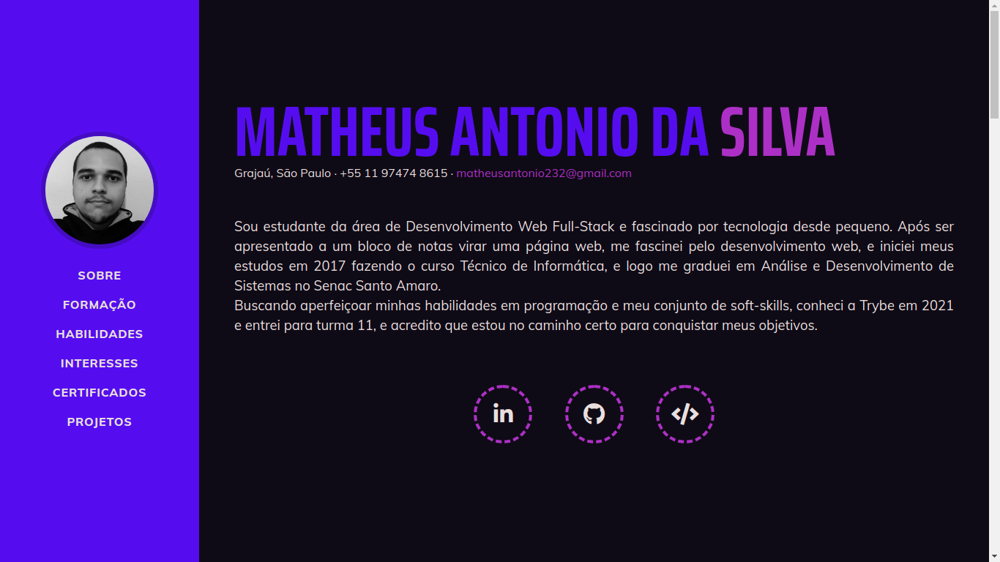
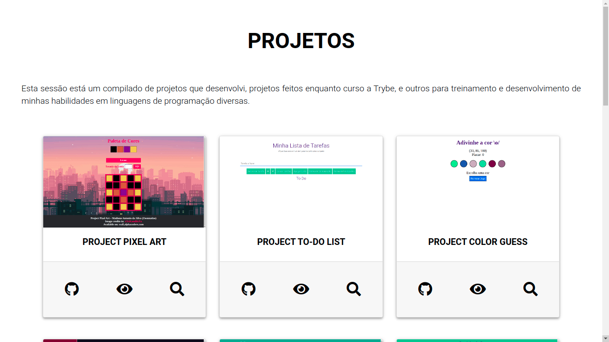

 <h1  align="center">Bem Vindo ao meu portfólio pessoal!</h1>

<h3 align="center"> <a href="https://zeonnatios.github.io/" target="_blank">Clique aqui para visitar o projeto</a> <h3>

  <a href="#bookmark-sobre">SOBRE</a>&nbsp;&nbsp;&nbsp;|&nbsp;&nbsp;&nbsp;
  <a href="#rocket-tecnologias">TECNOLOGIAS</a>&nbsp;&nbsp;&nbsp;|&nbsp;&nbsp;&nbsp;
  <a href="#technologist-integrantes">AUTOR</a>&nbsp;&nbsp;&nbsp;|&nbsp;&nbsp;&nbsp;
  <a href="#memo-licença">LICENÇA</a>

## :bookmark: Sobre

  Este é meu portfólio pessoal construído para divulgar meu perfil e minhas habilidades em programação através de projetos feitos.

## :rocket: Tecnologias

As seguintes ferramentas foram utilizadas para a construição da página desse projeto.

-  [HTML5](https://developer.mozilla.org/pt-BR/docs/Web/HTML)
-  [CSS3](https://developer.mozilla.org/pt-BR/docs/Web/CSS)
-  [Bootstrap](https://getbootstrap.com/)
-  [Bulma](https://bulma.io/)

## :technologist: Integrantes

  <a href="https://github.com/Zeonnatios">
    
       
      
        <b>Matheus Antonio da Silva</b>
      
  </a>

## :memo: Licença
Esse projeto está sob a licença MIT. Veja o arquivo [LICENSE](LICENSE) para mais detalhes.